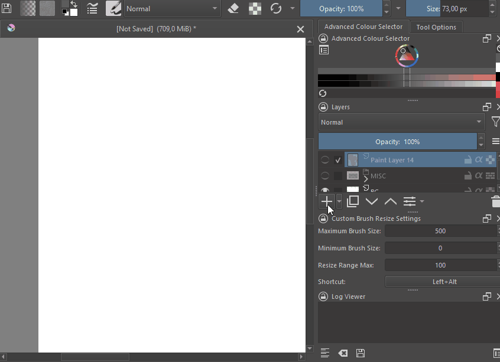
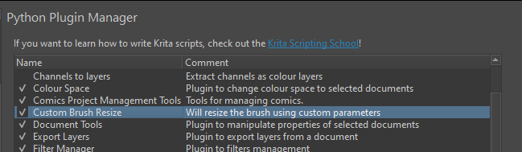
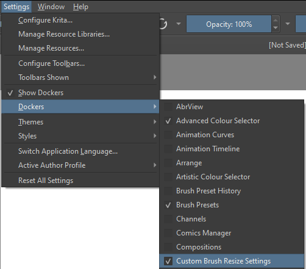
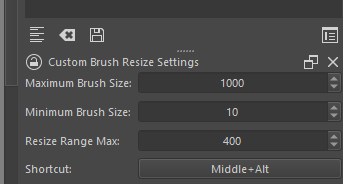
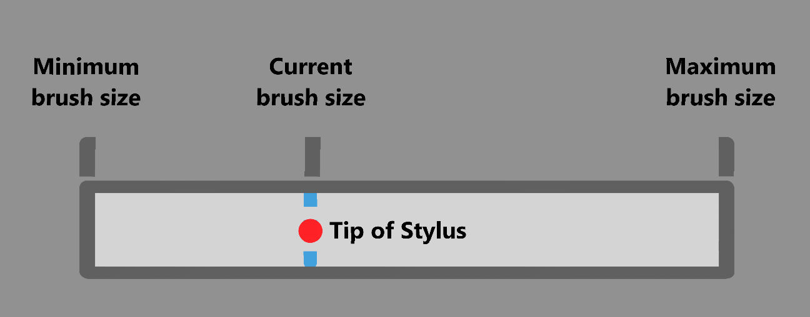

# Custom Brush Resize
The Custom Brush Resize plugin allows the user to configure how quickly the brush scales when using a mouse button + key board key shortcut combination.
This allows for the resizing to be as snappy or as slow as the artist would like.

---

## Why?
A few artists and myself started using Krita. One of these artists pointed out that the brush scaling in Krita when using stylus together with a modifier key, was significantly slower than the way that they are used to coming from Photoshop. They asked if there was a to make it scale faster.
I thought to myself, "surely there must be a way!", which led to the creation of the `Custom Brush Resize` plugin.

## Requirements
- Required version of Krita: **5.2.2** or later

## OS support
- [x] Windows (10, 11)
- [ ] Linux (Has not been tested)
- [ ] MacOS (Not planned as of now)
- [ ] Android (Not planned as of now)

## How to install this plugin
### On Windows
To automatically install the this plugin on Windows, you can run the `automatic_install.bat` file.

If you would like to manaully install the plugin, you can copy the `custom_brush_resize` folder and the `custom_brush_resize.desktop` file to the `%APPDATA%\krita\pykrita` folder.

Once the files have been copied you can launch Krita.

### Enabling within Krita
Within Krita, you can go to `Settings>Configure Krita>Python Plugin Manager`, and make sure the check box for the `Custom Brush Resize` plugin is checked.

To display the Custom Brush Resize settings docker, you can go to `Settings>Dockers` and make sure the check box for the `Custom Brush Resize Settings` is checked.

This will display the settings docker widget on the right.

## Plugin configuration
After enabling the plugin and the docker widget, you should see the settings within Krita.

There are 4 settings:
 - `Maximum Brush Size`
 - `Minimum Brush Size`
 - `Resize Range Max`
 - `Shortcut`

 The `Maximum Brush Size` caps the size of the brush tool to the set value. Just like the `Maximum Brush Size` setting, the `Minimum Brush Size` setting, prevents the brush tool from going below the set brush size.

 The `Resize Range Max` settings determines how far the stylus must move for the brush size to go from the `Minimum Brush Size` to the `Maximum Brush Size` brush size setting.

 You can define a custom shortcut by clicking on the shortcut button and pressing the desired shortcut. 

> **Note**
> Shortcuts are currently limited to a mouse button and keyboard key combinations.

## How does it work?
This plugin will remap the current brush tool's size to a smaller range, making it where the stylus does not have to move as far to increase and decrease the brush size.

The various settings give the user finer control of the brush scaling so it can be tweaked to the user's taste. 

The resizing of the brush is relative to the current set brush size. When the brush size is set to less than half of the `Maximum Brush Size` value, the stylus will have to move less than half of the distance to reach the `Minimum Brush Size`value. The total distance that the stylus must move is configured using the `Resize Range Max` setting.

## Limitations and Known Issues
As mentioned above, the shortcuts are limited to a mouse button and keyboard key combitions.

When using the `Left` mouse button within a shortcut, it will paint on the canvas before resizing due to the click being registered by Krita.

The diameter of the preview while resizing does not represent the actual diameter of the brush within the current document.

There is a visual bug where where both the Krita brush resize circle and the `Custom Brush Resize` resize circle are shown at the same time.

# Special thanks!
Thank you to [Brent Lecluyse](https://www.artstation.com/brentlecluyse) for inspiring the creation of this plugin!

